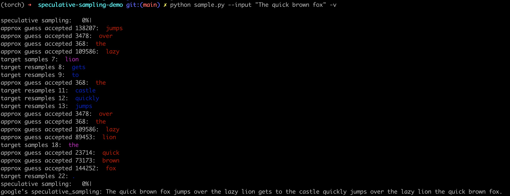

# Fast inference from transformers via speculative decoding

This repository implements speculative sampling for large language model (LLM) decoding. It utilizes two models during the decoding process: a target model and an approximation model. The approximation model is a smaller model, while the target model is a larger one. The approximation model generates token guesses, and the target model corrects these guesses. This approach allows for decoding by running the target model in parallel on the outputs of the approximation models, resulting in improved efficiency compared to decoding with the target model alone.

The speculative sampling is proposed by Google and Deepmind independently. So I implement two slightly different versions of speculative sampling: [Google's](https://arxiv.org/abs/2211.17192) and [Deepmind's](https://arxiv.org/abs/2302.01318).

## Update Logs

- 2023.09.21: Add serving features. Support more models, i.e. llama-7B and llama-1B.

- 2023.09.19: Add KV Cache Optimization to the Google's version.

- 2023.08.16: First release, implement the paper's algorithm. Support Bloom-560M and Bloomz-7B1.

## Usage
### Inference
You need prepare a pair of models using the same embedding and vocabulary. The approximation model should be smaller than the target model. Here are some
tested model pairs.


</center>

In the sample, we demostrate [bloomz-7b1](https://huggingface.co/bigscience/bloomz-7b1/tree/main) as the target model, [bloom-560m](https://huggingface.co/bigscience/bloom-560m/tree/main) as the approximation model. 

```bash
python main.py \
    --input "The quick brown fox jumps over the lazy " \
    --target_model_name bigscience/bloomz-7b1 \
    --approx_model_name bigscience/bloom-560m
```

You can also use `-v` args to see a token is generated by which model.



I recommand you to use llama2-7B and llama2-70B as the approximation and target model respectively. I did observe speedup on this case as shown in the following.
Note the choice of approx model and target model are essential for the speedup. The speedup will not be observed in the following cases:
If the models are both small ones, the speedup will not be observed since the speed differences are not significant.
If the model size difference is too large, more rejection and resampling will occure.
Also the sampling logic is not efficient enough. I noticed substantial overhead is on Softmax and Layernorm. I will try to optimize it in the future.
Do not histant to open an idea on performance improvements.

|    | llama2-7b | llama2-70b | Speculative |
|--------------|:--------------:|:--------------:|:--------------:|
| speed(tokens/sec) | 1084.86 | 329.83 | 427.02 |

### Serving
Start an inference server.
```bash
python serving.py
```

Test the serving with curl:
```bash
curl -X POST -H "Content-Type: application/json" -d '{"prompt": "Who is the president of the USA"}' http://127.0.0.1:5000/predict
```
## References
```
@inproceedings{leviathan2023fast,
  title={Fast inference from transformers via speculative decoding},
  author={Leviathan, Yaniv and Kalman, Matan and Matias, Yossi},
  booktitle={International Conference on Machine Learning},
  pages={19274--19286},
  year={2023},
  organization={PMLR}
}

@article{chen2023accelerating,
  title={Accelerating large language model decoding with speculative sampling},
  author={Chen, Charlie and Borgeaud, Sebastian and Irving, Geoffrey and Lespiau, Jean-Baptiste and Sifre, Laurent and Jumper, John},
  journal={arXiv preprint arXiv:2302.01318},
  year={2023}
}
```

## Limitations
Currently, I only support request of batch size as 1.
Since this repo is built for demostration purpose, other optimizations, such as batching and parallelism, are not included which are essential for efficiency.